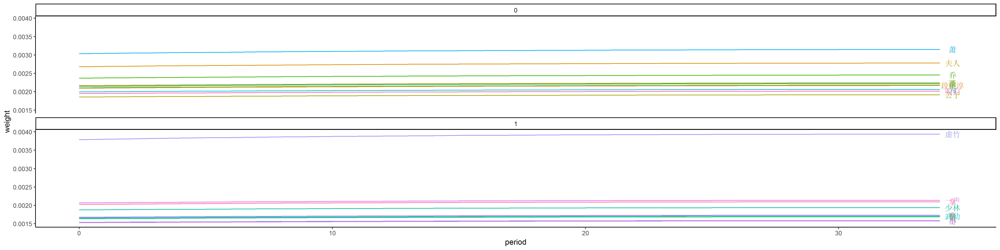
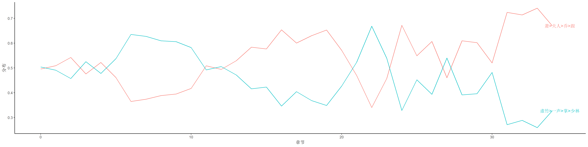

```{r}
library(tidyverse)
```

```{r}
df <- read_csv("../output/demo_model_df.csv")
dict <- read_tsv("../output/demo_dict_text.txt", skip = 6, col_names = c("word_id", "word_name", "freq")) %>% 
    select(-freq)
df <- 
df %>% 
    left_join(dict, by = c("word"="word_id")) %>% 
    mutate(word = word_name) %>% 
    select(-word_name)
```

```{r}
df %>%
    ggplot() +
    aes(x = period, y = weight, color = word) +
    geom_line() +
    geom_text(
        data = function(x) df %>% filter(period == max(period)),
        aes(label = word), nudge_x = 0.5
    ) +
    facet_wrap(~ topicId, nrow = 2) +
    theme_classic() +
    theme(legend.position = "None")
ggsave("../figure/demo_word_evolution.png", height = 5, width = 20)

```

# Topic Evolution

```{r}
word_df <- df
topic_df <- read_csv("../output/demo_topic_df.csv")
```

```{r}
topic_label <-
    word_df %>%
    # distinct(topicId)
    group_by(topicId, word) %>%
    summarise(weight = median(weight)) %>%
    group_by(topicId) %>%
    arrange(desc(abs(weight))) %>%
    mutate(row_number = row_number()) %>%
    filter(row_number <= 4) %>%
    summarise(text = str_flatten(word, ">"))
```


```{r}
df <- topic_df %>%
    # 也是求文档的均值
    group_by(period, topicId) %>%
    summarise(distribution = mean(distribution)) %>%
    left_join(topic_label, by = "topicId") %>%
    mutate(topicId = as.factor(topicId)) %>% 
    ungroup()
df %>% 
    ggplot() +
    aes(x = period, y = distribution, color = topicId) +
    geom_line() +
    geom_text(
        data = function(x) df %>% filter(period == max(period)),
        aes(label = text), nudge_x = 0.5
    ) +
    theme_classic() +
    theme(legend.position = "None") + 
    labs(y = '分布', x = '章节')
ggsave("../figure/demo_topic_evolution.png", height = 5, width = 20)

```

