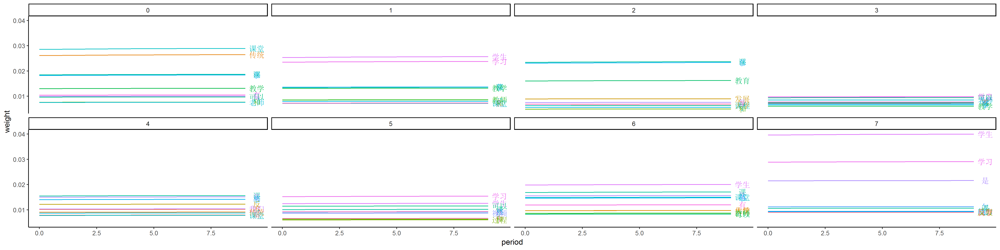

```{r}
library(tidyverse)
```

```{r}
df <- read_csv("../output/model_df.csv")
```

```{r}
df %>% 
    ggplot() +
    aes(x = period, y = weight, color = word) +
    geom_line() +
    geom_text(
        data = function(x) df %>% filter(period == max(period)),
        aes(label = word), nudge_x = 0.5
    ) +
    facet_wrap(~ topicId, nrow = 2) +
    theme_classic() +
    theme(legend.position = "None")
ggsave("../figure/word_evolution.png", height = 5, width = 20)

```

